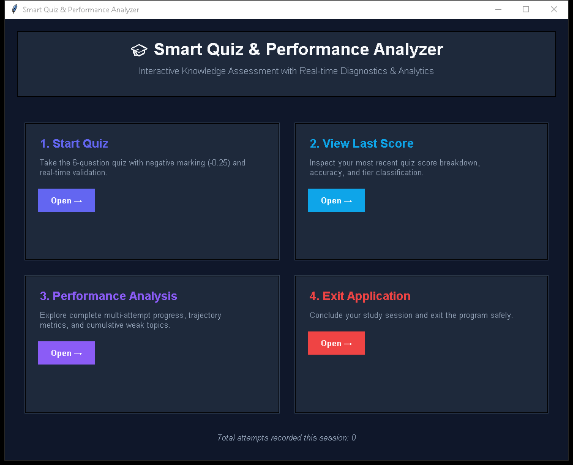
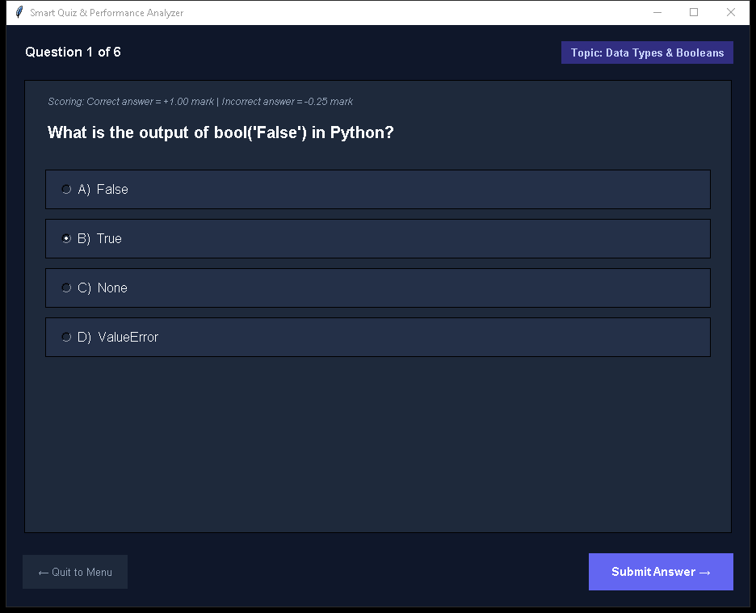
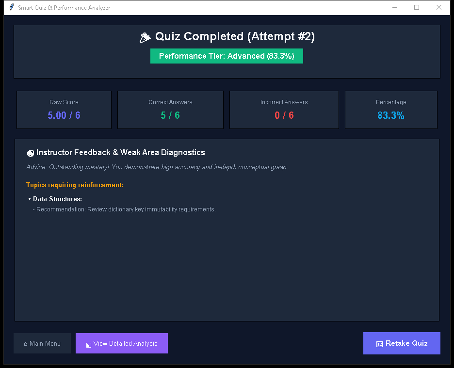
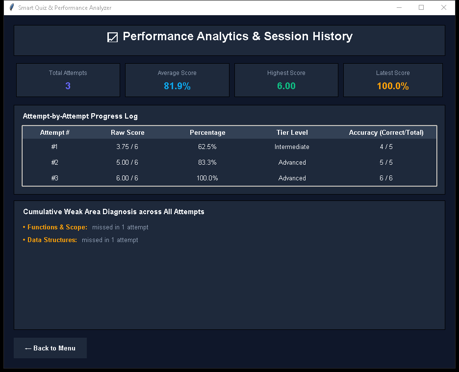

# Smart Quiz & Performance Analyzer System

A complete, beginner-friendly Python application featuring both a **modern Tkinter Graphical User Interface (GUI)** and an **interactive Console-based system**. Designed to evaluate, diagnose, and elevate understanding of fundamental Python concepts.

---

## Key Features

1. **Dual Interface (Tkinter GUI & Console CLI)**:
   - **Tkinter GUI (`quiz_gui.py`)**: Modern dark-themed dashboard, responsive card layouts, interactive option selectors, instant feedback dialogs, Treeview progress table, and visual badge indicators.
   - **Console Version (`quiz_system.py`)**: Robust menu-driven terminal interface with strict input validation and cleanly formatted tables.

2. **Core Quiz Logic & Strict Validation**:
   - 6 thoughtfully crafted multiple-choice questions stored in structured dictionaries with topic mappings and teacher explanations.
   - Requires valid selection (`A`, `B`, `C`, or `D`) before progressing.

3. **Negative Marking Mechanism**:
   - Correct answer: `+1.00` mark.
   - Incorrect answer: `-0.25` mark penalty.

4. **Weak Area Detection & Targeted Feedback**:
   - Tracks missed questions by subject category (`Data Types & Booleans`, `Data Structures`, `Exception Handling`, `Control Flow & Loops`, `Functions & Scope`, `Lists & Operations`).
   - Generates personalized study recommendations based on identified mistakes.

5. **Performance Classification**:
   - Computes percentage score with 3 distinct performance tiers:
     - **Beginner**: `< 50%`
     - **Intermediate**: `50% - 79%`
     - **Advanced**: `>= 80%`

6. **Multi-Attempt History & Progress Tracking**:
   - Tracks every quiz attempt across the session.
   - **Performance Analysis**:
     - Attempt-by-attempt history log (Score, Percentage, Tier, Accuracy).
     - Session statistics (average score, highest score, score trajectory).
     - Cumulative weak area diagnostics ranked by error frequency across attempts.

---

## How to Run

### 1. Launch the Tkinter GUI
```bash
py quiz_gui.py
```
*or simply:*
```bash
py main.py
```

### 2. Launch the Console/Terminal Version
```bash
py quiz_system.py
```
*or:*
```bash
py main.py --cli
```

---

## Application Screenshots

### 1. Main Dashboard


### 2. Interactive Quiz Runner


### 3. Quiz Results & Weak Area Diagnostics


### 4. Multi-Attempt Performance Analytics


